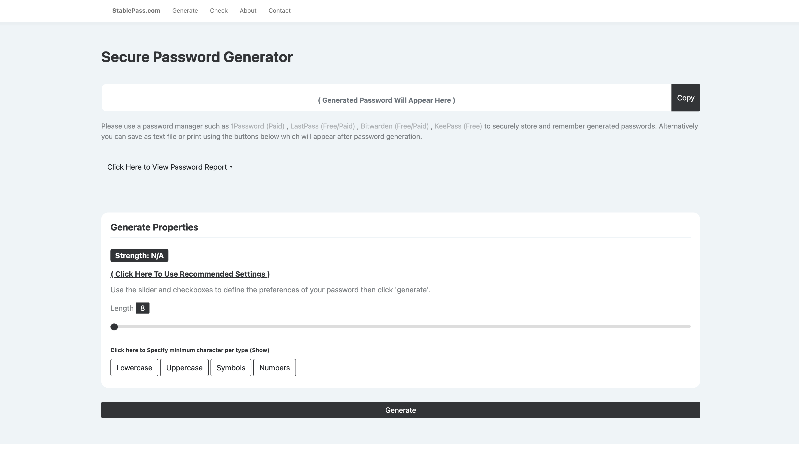
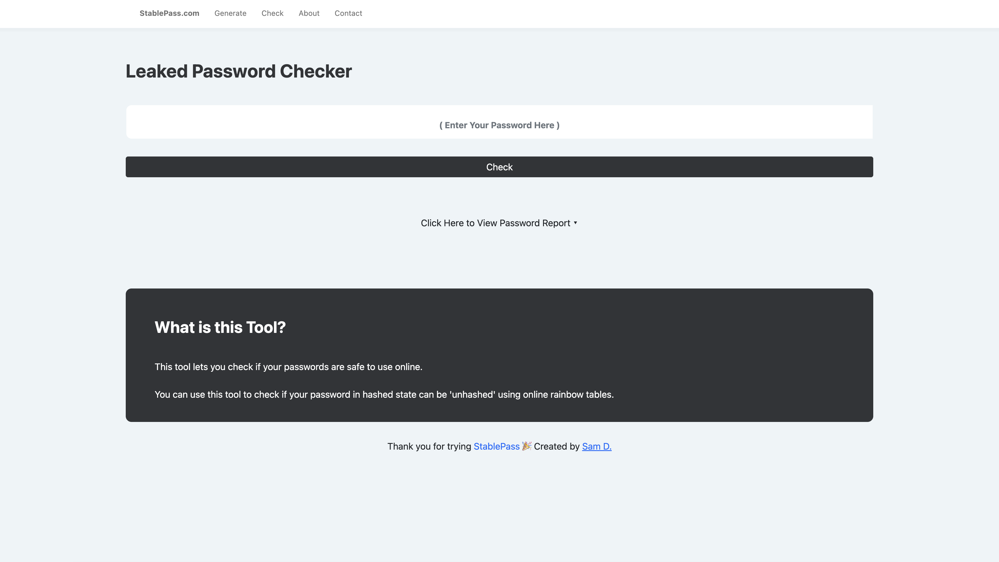

# StablePass

**StablePass** is a powerful tool designed to generate secure, random passwords that are specifically engineered to withstand common cyberattacks.

Unlike standard generators, every password created by StablePass is automatically cross-referenced against a network of **20+ popular online rainbow tables**. If a generated password’s hash is found in these databases (meaning it can be reversed to plaintext instantly), StablePass discards it and generates a new one.





---

## 🌐 Access StablePass

The primary and easiest way to use the tool is via our official website:

👉 **https://stablepass.com**

---

## 🐳 Self-Host (Docker)

If you prefer to run your own instance for privacy or offline use, you can deploy StablePass via Docker. This ensures all dependencies are correctly configured without polluting your local environment.

### 1. Run the Container

```bash
docker run -d \
  --name stablepass \
  --restart unless-stopped \
  -p 8080:5000 \
  secbysam/stablepass:latest
```

### 2. Access the Application

Open your browser and navigate to:

```
http://localhost:8080
```

> If deploying on a remote server, replace `localhost` with your server’s IP address.

---

## 🛠️ Technical Notes & Dependencies

### ⚠️ Important Note on Python Libraries

You may notice that `requirements.txt` specifies older versions of Flask and Werkzeug. This is **intentional**.

- **Search-That-Hash (S-T-H)**  
  This core library is no longer actively maintained and requires an older version of the `click` library.

- **Flask Compatibility**  
  Newer versions of Flask (3.0+) are incompatible with the required version of `click`.

- **Werkzeug Pinning**  
  We strictly pin `Werkzeug==2.2.2`. Newer versions (3.0+) removed the `url_quote` function, which causes the application to crash due to legacy Flask dependencies.

🚫 **Do not upgrade these packages** in `requirements.txt` or the application will fail.

---

## 🛡️ How StablePass Protects You

1. **Password Generation**  
   Users customize password properties such as length and character mix.

2. **Hashing & Verification**  
   The candidate password is hashed (MD5, SHA-256, etc.) and checked against **20+ online rainbow tables**.

3. **Secure Delivery**  
   Only passwords that return **zero matches** (uncrackable via rainbow tables) are delivered to the user.

This approach ensures passwords are not just mathematically complex, but also resilient against **precomputed hash attacks**.

---

## ✨ Features

- **Rainbow Table Resistance** – Ensures passwords do not exist in known leak databases  
- **OWASP Standard Compliance** – Generates strong passwords following modern security guidelines  
- **Simple & Advanced Modes** – Tailor complexity to your specific needs  
- **Privacy First** – No personal data collection, logging, or password storage  
- **Free & Open Source** – Completely free to use  

---

## 📦 Manual Installation (Python)

If you prefer to run without Docker, ensure you are using **Python 3.9**.

### 1. Clone the Repository

```bash
git clone https://github.com/yourusername/stablepass.git
cd stablepass
```

### 2. Install Dependencies

```bash
pip install -r requirements.txt
```

### 3. Run the Application

```bash
python app.py
```

---

## 🙏 Acknowledgments

- **Search That Hash (S-T-H)** – An open-source project for secure hash searching that powers our verification engine  
- Inspired by best practices from cybersecurity experts on password generation and storage  

---

## 🤝 Contributing

Contributions are welcome!  
Feel free to fork this repository, submit pull requests, or open issues to help improve StablePass.
